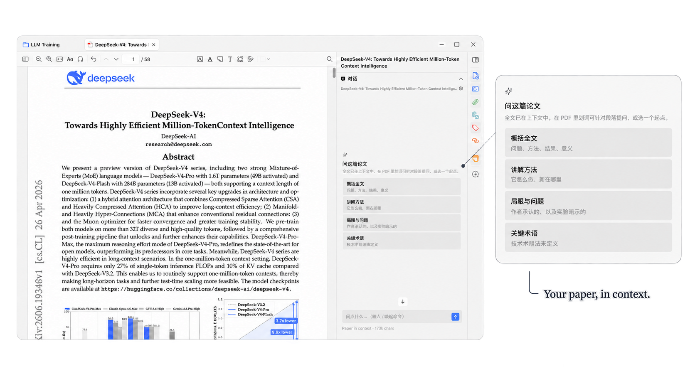
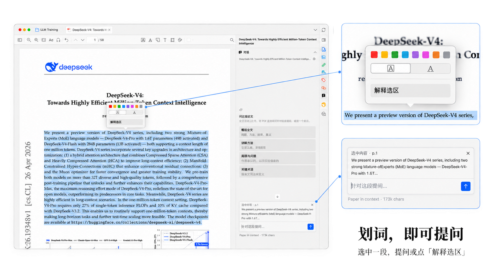
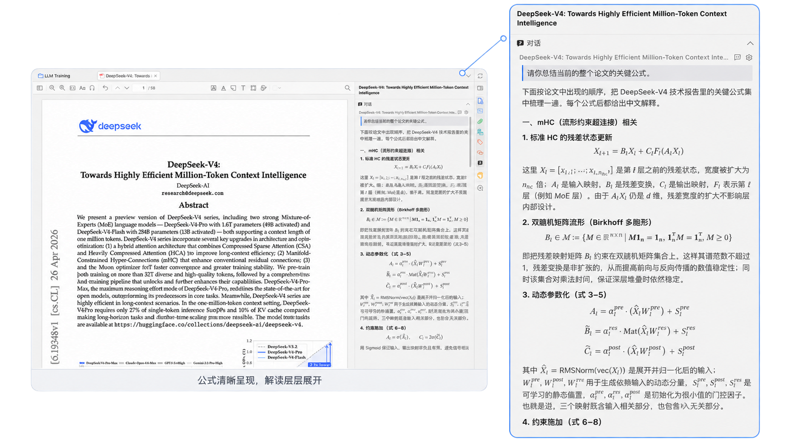

<p align="center">
  
</p>

<p align="center"><strong>Ask questions about your paper, right inside Zotero.</strong></p>

<p align="center">
  English · <a href="README.zh-CN.md">简体中文</a><br>
  <a href="#installation">Installation</a> ·
  <a href="#interface-preview">Interface preview</a> ·
  <a href="#compatibility-and-limitations">Compatibility</a> ·
  <a href="docs/README.md">Documentation</a> ·
  <a href="docs/changelog.md">Changelog</a>
</p>

**ZoteroChat** is a PDF reading assistant in Zotero's sidebar. Ask about the paper, discuss a highlighted passage, or work through an explanation with rendered equations. The extracted paper text stays in the conversation context, with a stable prompt prefix designed to support provider-side caching.

> **Early release:** conversations are held in memory and are not restored after a restart. Recreating the sidebar, including some tab changes, starts a new conversation. Save any answers you need before leaving the session.

## Features

- **Discuss the current paper.** Start with a summary, methods, limitations, or key terms, then ask follow-up questions.
- **Ask about a passage.** Highlight text to attach it to your next question, or choose **Explain selection** in the reader popup.
- **Read formatted answers.** Responses stream into the sidebar with Markdown and LaTeX equations.
- **Choose your reading preferences.** Set the reply language and text size, and use `/` for quick prompts.
- **Inspect token usage.** See input/output tokens and cache hits when the provider returns them.

## Interface preview

A compact sidebar, restrained controls, and readable text keep the paper and the conversation together. The screenshots below show the Chinese interface; select an image to view it at full size.

### A conversation beside the paper

Open the sidebar without leaving the reader. Quick prompts provide a starting point for exploring the paper.

<p align="center">
  <a href="docs/screenshots/01-reader-chat.png">
    
  </a>
</p>

### From a highlight to a question

The reader popup offers **Explain selection**, while a removable selection chip shows which passage will accompany the next question.

<p align="center">
  <a href="docs/screenshots/02-selection.png">
    
  </a>
</p>

### Answers with structure and equations

Headings, paragraphs, and rendered equations make detailed explanations easier to follow alongside the source paper.

<p align="center">
  <a href="docs/screenshots/03-real-chat.png">
    
  </a>
</p>

## Installation

You need Zotero, a PDF with extractable text, and access to a model endpoint. Hosted APIs require your own API key and may charge for requests.

1. Obtain a `.xpi` from the project's [Releases page](https://github.com/TianSuya/ZoteroChat/releases), when a release is available. If the page is unavailable or has no installer, [build from source](#build-from-source).
2. In Zotero, open **Tools → Plugins → gear → Install Plugin From File…** and select the `.xpi`.
3. Restart Zotero, then open **Zotero → Settings → ZoteroChat** on macOS, or **Edit → Settings → ZoteroChat** on Windows/Linux. You can also use the sidebar's settings button.
4. Enter your Base URL, API key, and model. Use **Test connection** to check the configuration.
5. Open a PDF in Zotero's reader and select the chat icon in the right sidebar.

The current defaults are:

| Setting        | Default                          |
| -------------- | -------------------------------- |
| Base URL       | `https://api.deepseek.com`       |
| Model          | `deepseek-flash`                 |
| API key        | Empty; supply your own           |
| Reply language | Simplified Chinese; configurable |

The client appends `/chat/completions` to the Base URL. Include any API version prefix required by your endpoint; do not enter the complete completion URL. A successful connection test does not validate streaming, cache reporting, or every model option.

### Build from source

Use **Node.js 24** and npm. From the repository root:

```bash
npm ci
npm run build:production
```

Install the `.xpi` generated under `.scaffold/build/`. Building does not require a Zotero installation, a development profile, or an API key. See [release preparation](release/README.md) for packaging checks.

## Usage

1. Ask a question or select a quick prompt in the sidebar.
2. To focus on a passage, highlight it in the PDF. The selection appears above the input and is included when you send. Remove the selection chip to omit it from the next request's new message; selections already sent remain in conversation history.
3. Press **Enter** to send or **Shift+Enter** for a new line. Use the stop button to interrupt a response.
4. Use **New conversation** to reset the current session. Copy answers you want to keep; automatic saving and Zotero note export are not available yet.

## Compatibility and limitations

| Area                 | Current status                                                                                                                                                                                                                             |
| -------------------- | ------------------------------------------------------------------------------------------------------------------------------------------------------------------------------------------------------------------------------------------ |
| Zotero               | Development validation is documented on Zotero 9.0.6 / Gecko 140. Zotero 7–9 are compatibility targets; Zotero 7 and 8 have not completed a test matrix.                                                                                   |
| Operating systems    | Cross-platform verification is incomplete. Report the OS and Zotero version with compatibility issues.                                                                                                                                     |
| Model endpoints      | DeepSeek is the documented development endpoint. Other OpenAI-compatible Chat Completions services and local servers require validation. The client currently sends `thinking` and streaming usage options without capability negotiation. |
| Local servers        | The settings loader currently requires a nonempty API key, even if the server itself does not require authentication.                                                                                                                      |
| Conversation history | Memory only. No restart recovery, editing of committed messages, or conversation branches. Sidebar recreation can reset history.                                                                                                           |
| Long documents       | The paper and conversation must fit the model's context window. Automatic compression and context-limit handling are not implemented.                                                                                                      |
| PDF content          | Uses extracted text, not page images. No built-in OCR or visual understanding of figures. Text extraction can omit layout or mathematical detail.                                                                                          |
| References           | Full-text extraction does not preserve page mapping. Check claims and references against the paper.                                                                                                                                        |

## Data and privacy

PDF text extraction happens locally in Zotero. When you send a question, the configured model endpoint receives the extracted paper text, available bibliographic metadata, conversation history, the question, and any attached selection. The plugin sends text rather than the PDF file itself.

The API key is stored in the current Zotero profile's preferences, not in an encrypted credential store, and is sent in the authorization header to the configured endpoint. Choose an endpoint appropriate for the documents you read. Provider retention policies and API charges apply to requests made to that provider; ZoteroChat does not include a hosted model subscription.

Before sharing diagnostic logs, remove credentials, private document text, and identifying metadata. See [security reporting](SECURITY.md).

## Context caching

ZoteroChat keeps the system prompt and extracted paper block stable, then appends completed turns. Reply-language instructions and the current selection are added to the new turn. This structure is intended to make repeated context eligible for a provider's prompt cache.

Two separate signals are available: `PrefixLedger` detects changes to the local message prefix, while provider usage fields report actual cache hits. A stable local prefix does not guarantee a cache hit or a particular cost reduction. End-to-end cache benchmarks are still pending, and the client does not yet send `prompt_cache_key`.

See the [context design](docs/overview.md) and [prefix-freezing decision](docs/adr/0003-prefix-freeze.md) for implementation details and validation plans.

## Troubleshooting

| Symptom                        | What to check                                                                                                  |
| ------------------------------ | -------------------------------------------------------------------------------------------------------------- |
| Sidebar asks you to open a PDF | Open the attachment in Zotero's reader; the library view is not a chat session.                                |
| Connection fails               | Check Base URL, model, API key, and the provider's error response. Do not post your key in an issue.           |
| Text extraction fails          | Confirm the PDF has selectable text. Image-only scans need text extraction/OCR outside this plugin.            |
| History disappears             | Persistence is not implemented; a recreated panel starts a new session.                                        |
| No cache statistics            | The endpoint may not return streaming usage or cache fields. Missing statistics do not establish a cache miss. |

For other issues, use the [bug report form](https://github.com/TianSuya/ZoteroChat/issues/new?template=bug_report.yml) with reproduction steps and version information. Runtime troubleshooting notes are in [docs/environment.md](docs/environment.md).

## Development and contributing

After `npm ci`, copy `.env.example` to `.env` and set the Zotero executable plus **separate development profile and data directories**. Then run `npm start`. Use a disposable library for development.

```bash
npm run check              # Lint, formatting, types, and unit tests
npm run build:production   # Production XPI
```

See [CONTRIBUTING.md](CONTRIBUTING.md) for the contribution workflow and [docs/development.md](docs/development.md) for Zotero setup and runtime probes. English and Chinese issues and pull requests are welcome. Most design notes are currently in Chinese.

Upcoming work includes persistent conversations, long-document compression, and export to Zotero notes. Track implementation status in the [roadmap](docs/roadmap.md).

## License

ZoteroChat's original code is licensed under the [PolyForm Noncommercial License 1.0.0](LICENSE.md). It is **source-available**, rather than open source under the [OSI definition](https://opensource.org/osd), because it restricts commercial use.

- **Noncommercial use:** you may use, copy, modify, and redistribute the software for purposes permitted by the license, including personal study and noncommercial experimentation.
- **Education and public research:** the license expressly permits use by educational institutions, public research organizations, and the other organizations listed in its Noncommercial Organizations section, regardless of their funding sources or related obligations.
- **Commercial use:** uses outside the license's permitted purposes require a separate written license from the relevant rights holders. This includes selling a repackaged plugin, offering a paid service based on it, or integrating it into a commercial product when those activities are outside the permitted purposes. Making a modified version does not remove this requirement.
- **Redistribution:** include the license text or its official URL and retain all `Required Notice:` lines. Third-party code and materials remain under their respective licenses; this license does not replace those terms.

Required Notice: Copyright (c) 2026 bowentian

For commercial licensing inquiries, [contact the maintainer through a GitHub issue](https://github.com/TianSuya/ZoteroChat/issues/new?title=Commercial%20licensing%20inquiry). Opening an inquiry does not grant permission. This summary is informational; the [full license](LICENSE.md) governs.
